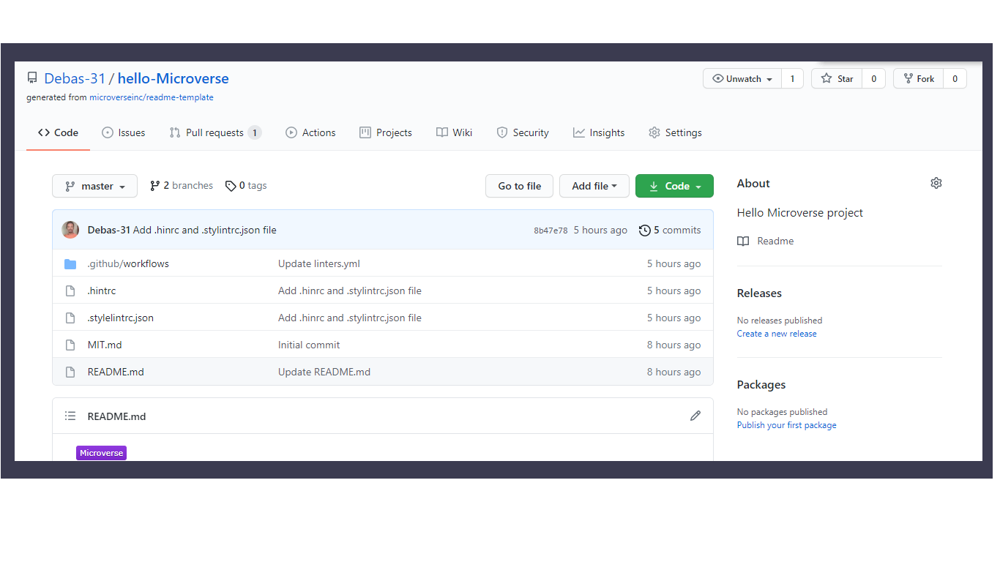

# hello-Microverse project
>This is a project mainly focus on how to setup github work flow,linters setup and ask pull request.

### Built With

- HTML5
- CSS3

### Live Demo

[Visit the Live Demo]( https://debas-31.github.io/hello-Microverse)

### Authors

👤 **Debas Gebreslasie**

- [GitHub](https://github.com/Debas-31)
- [Twitter](https://twitter.com/DEBSH76956492)
- [LinkedIn](https://www.linkedin.com/in/debas-gebrengus-5256a2159/)

### 🤝 Contributing

Contributions, issues, and feature requests are welcome!

Feel free to check the [issues page](https://github.com/Debas-31/hello-Microverse/issues).

### Show your support

Give a ⭐️ if you like this project!

### Acknowledgments
- Microverse

## 📝 License

This project is [MIT](https://github.com/Debas-31/hello-Microverse/blob/greeting/MIT.md) licensed.